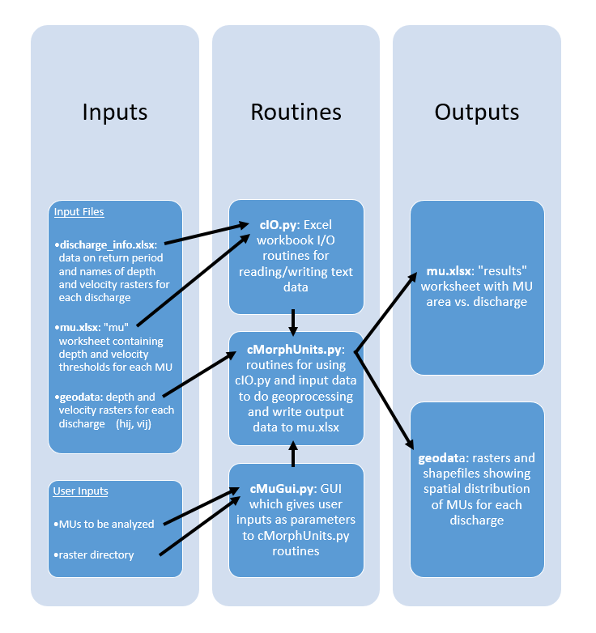

# HYD 298: Assignment #3

## How to Use

1. Clone this repository.
2. Confirm the `python.exe` path is correct in `launch_mu_gui.bat`, change if needed.
3. Run `launch_mu_gui.bat`. Select desired MUs to analyze with the GUI and press "Run" button.
4. The output data will be in the "results" worksheet of `mu.xlsx`.

## Mindmap of Code

